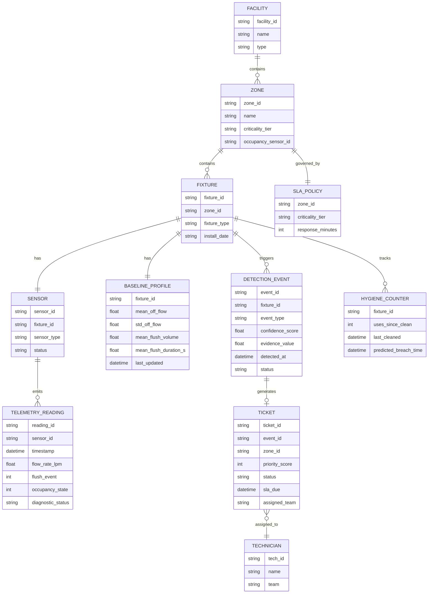

# PRD — Kohler Smart Facility & Sustainability Manager
## Hospital Deployment Edition
**Track 2 — KOHLER-MITWPU AI Research Lab Program**

Document owner: [Your Name]
Build target: Antigravity (agentic build), incremental delivery model
Version: 1.0

---

## 1. Problem Statement

Hospitals run water and sanitary fixtures continuously, at high volume, across zones with very different risk profiles — an ICU restroom, an operating theatre scrub station, and a visitor lobby restroom are not interchangeable in either water-criticality or hygiene-criticality. Today, leaks are caught by chance (a nurse notices, a bill spikes) and cleaning is scheduled on a fixed calendar rather than actual usage. Both waste water and staff time, and in a hospital, hygiene lapses carry infection-control risk, not just inconvenience.

This system continuously ingests fixture-level telemetry, distinguishes real anomalies from sensor noise and normal usage variance, and turns high-confidence detections into prioritized, explainable maintenance tickets — before the facility team would otherwise notice.

## 2. Goals

| Goal | Metric |
|---|---|
| Catch real leaks fast, without alert fatigue | Precision ≥ 90%, Recall ≥ 85% on synthetic leak-injection test set |
| Predict hygiene threshold breaches, not just react | Median lead time ≥ 30 min before threshold breach |
| Separate faulty sensors from real facility problems | Sensor-health false-attribution rate < 5% |
| Route the right ticket to the right team, fast | Priority scoring aligned to zone criticality tier; auto-escalation on SLA breach |
| Make the business case tangible | Live-running sustainability counter (litres/₹/CO₂ saved) |

## 3. Non-Goals (v1)

- No physical hardware integration — telemetry is simulated but schema-compatible with real IoT sensor payloads (so swapping in real sensors later is a config change, not a rewrite).
- No patient-data / EHR integration. This system only touches facility telemetry, never clinical data.
- No mobile app — dashboard is responsive web, not native.
- No billing/procurement workflow — tickets stop at "dispatched and tracked to resolution."

## 4. Users / Personas

- **Facility Manager (primary)** — monitors the live dashboard, triages tickets, needs to trust *why* something was flagged.
- **Maintenance Technician** — receives dispatched tickets with location, issue type, priority, evidence.
- **Infection Control / Hygiene Officer** — cares specifically about hygiene-threshold alerts in high-risk zones (OT, ICU, isolation wards).
- **Hospital Administrator** — cares about the sustainability/cost dashboard, not day-to-day tickets.

## 5. Hospital Zone Model

Zones carry a **criticality tier**, which drives detection sensitivity, hygiene thresholds, and SLA urgency. This is the hospital-specific backbone of the whole system.

| Tier | Example Zones | Leak Sensitivity | Hygiene Threshold (uses before cleaning) | Ticket SLA |
|---|---|---|---|---|
| Tier 1 — Critical Care | ICU restrooms, Operating Theatre scrub stations, Isolation wards | Highest (shortest confirmation window) | 15–20 uses | 15 min |
| Tier 2 — Patient Care | General ward restrooms, patient bathrooms | High | 25–30 uses | 30 min |
| Tier 3 — Clinical Support | Staff scrub rooms, lab washrooms | Medium | 35–40 uses | 1 hr |
| Tier 4 — Public/Admin | Lobby restrooms, cafeteria, visitor washrooms, admin offices | Standard | 50–60 uses | 2 hr |

Fixture types modeled: **faucets, flush valves/toilets, urinals, showers (patient bathing), scrub-station taps**. Each fixture type has different "normal" flow signatures — this matters for baseline modeling (Section 7).

## 6. Domain Model



### Entity notes

- **BASELINE_PROFILE** is per-fixture, not global. A fixture "learns" its own normal behavior over a rolling window (default: 7 days) before detection logic is trusted at full sensitivity — during this warm-up period, events are logged but not auto-dispatched (see Section 7.5).
- **DETECTION_EVENT** always carries a `confidence_score` and `evidence_value` (e.g. litres/hour estimated waste) — this is what makes alerts explainable, not a black-box flag.
- **HYGIENE_COUNTER** is forward-looking: it stores a *predicted* breach time, not just a current count, computed from recent usage rate (Section 8).

## 7. Leak Detection Logic

This is the core differentiator of the build — layered detection, not a single flow threshold.

### 7.1 Baseline learning (per fixture)

For each fixture, maintain a rolling statistical profile from historical telemetry:
- `mean_off_flow`, `std_off_flow` — flow rate when the fixture *should* be idle (derived from periods where occupancy = 0 and no flush event has occurred in the last N seconds).
- `mean_flush_volume`, `std_flush_volume`, `mean_flush_duration_s` — derived from historical flush events.
- Recompute nightly via exponentially-weighted update: `new_mean = α × observed + (1−α) × old_mean`, α ≈ 0.1, so the baseline adapts slowly (won't be fooled by one unusual day, but does track genuine long-term drift like a fixture aging).

### 7.2 Signal 1 — EWMA control-chart on flow-when-idle

For every reading where `occupancy_state == 0`, compute an EWMA of flow rate:

```
EWMA_t = λ × flow_t + (1 − λ) × EWMA_(t−1)      (λ ≈ 0.2)
UCL = mean_off_flow + L × std_off_flow           (L ≈ 3, tunable per tier)
```

If `EWMA_t > UCL` continuously for longer than `confirmation_window` (tier-dependent — 3 min for Tier 1, up to 10 min for Tier 4), raise a **candidate leak event**. Using EWMA instead of the instantaneous reading absorbs sensor jitter and short blips (e.g. pressure fluctuation from another fixture flushing), which is exactly the source of false positives a naive threshold check would produce.

### 7.3 Signal 2 — Occupancy cross-check (confidence booster)

A candidate leak event's confidence score is boosted sharply if it coincides with `occupancy_state == 0` for the full confirmation window — flow with nobody present is much stronger evidence than flow while someone might legitimately be running a tap. If occupancy is unavailable/faulty for that zone, fall back to Signal 1 alone at a lower base confidence.

### 7.4 Signal 3 — Post-flush return-to-baseline check

For flush-type fixtures, every flush event should show: sharp flow spike → return to near-`mean_off_flow` within `mean_flush_duration_s + 2×std`. If flow fails to return to baseline after a flush (stuck valve pattern), raise a **high-confidence leak event** immediately — this pattern is distinctive enough that it doesn't need the full EWMA confirmation window.

### 7.5 Confidence scoring

```
confidence = w1×(EWMA deviation, normalized) 
           + w2×(occupancy cross-check boost, 0 or 1) 
           + w3×(post-flush pattern match, 0 or 1)
           − penalty(sensor_health_score)
```
Default weights: w1=0.4, w2=0.35, w3=0.25 (tunable; document final values chosen after simulator testing in the validation report).

- **confidence < 0.5** → logged only, not dispatched (avoids alert fatigue).
- **0.5 ≤ confidence < 0.8** → ticket created, standard SLA.
- **confidence ≥ 0.8** → ticket created, escalated priority regardless of zone tier.
- Fixtures still in the 7-day baseline warm-up period cap at "logged only" regardless of score.

### 7.6 Estimated waste (the evidence shown to the facility manager)

```
estimated_litres_wasted = (EWMA_t − mean_off_flow) × duration_minutes
```
This number is what turns into the sustainability dashboard metric and what a technician sees as the reason for the ticket — never show a raw confidence float alone.

## 8. Hygiene Threshold Prediction

Rather than alert only once `uses_since_clean` crosses the zone's static threshold (Section 5 table), forecast the breach:

```
recent_use_rate = uses in last 60 minutes / 60          (uses per minute)
uses_remaining = threshold − uses_since_clean
predicted_breach_time = now + (uses_remaining / recent_use_rate)
```

If `predicted_breach_time − now ≤ lead_time_target` (default 30 min, shorter for Tier 1), raise a **predictive hygiene ticket** so cleaning staff arrive before the threshold is actually crossed. Recompute `recent_use_rate` on a sliding window so it adapts to traffic bursts (e.g. shift changes, visiting hours).

## 9. Sensor Health Scoring

Purpose: keep bad sensor data from being misread as a facility problem — this is what makes the whole system trustworthy rather than noisy.

Per sensor, track over a rolling window:
- **Missing-data rate** — expected reading interval vs. actual gaps.
- **Flatline detection** — identical reading repeated beyond a plausible duration.
- **Out-of-range values** — physically impossible flow/occupancy values.
- **Drift** — baseline that shifts implausibly fast (faster than any real fixture would plausibly degrade).

```
sensor_health_score = 1 − (0.3×missing_rate + 0.3×flatline_flag + 0.2×out_of_range_rate + 0.2×drift_flag)
```

If `sensor_health_score < 0.6`, any detection event from that sensor is downgraded to "logged only" and a separate **sensor-maintenance ticket** is raised instead of a leak/hygiene ticket — the system explicitly tells the facility team "this sensor needs attention" rather than crying wolf about a fixture.

## 10. Ticket Priority & Dispatch

```
priority_score = (zone_criticality_weight × 0.4)
               + (confidence_score × 0.3)
               + (normalized_estimated_waste × 0.2)
               + (SLA_urgency_factor × 0.1)
```
- `zone_criticality_weight`: Tier 1 = 1.0, Tier 2 = 0.75, Tier 3 = 0.5, Tier 4 = 0.25.
- Tickets sorted by `priority_score` descending on the dashboard and in the dispatch queue.
- **Auto-escalation**: if a ticket is not acknowledged within its zone's SLA window (Section 5), priority is boosted and it's re-surfaced/re-notified.
- Every ticket carries: fixture ID, zone + tier, event type (leak / hygiene / sensor-fault), evidence (estimated litres/hr or predicted breach time), confidence score, and a one-line auto-generated plain-English summary (Section 12).

## 11. System Architecture

```
[Telemetry Simulator] → [Ingestion API] → [Detection Engine] → [Event Store]
                                                    ↓
                                          [Ticket Dispatch Engine] → [Ticket Store]
                                                    ↓
                              [Dashboard (web)]  ←  [Query/API layer]  →  [LLM Summary + Chat layer]
```

- **Telemetry Simulator**: generates realistic multi-fixture, multi-zone streams with time-of-day/shift patterns and injectable anomaly scenarios (for both demo and accuracy validation).
- **Ingestion API**: `POST /telemetry` — schema-compatible with real sensor payloads.
- **Detection Engine**: implements Sections 7–9; stateful per-fixture baseline tracking.
- **Ticket Dispatch Engine**: implements Section 10; manages ticket lifecycle (`open → acknowledged → in_progress → resolved`) and SLA timers.
- **Dashboard**: live facility heatmap by zone/tier, active alerts feed, ticket board (kanban-style), sustainability counter, per-fixture drill-down showing the evidence behind any flagged event.
- **LLM layer**: (a) turns a raw `DETECTION_EVENT` into the plain-English ticket summary; (b) a chat-over-data interface answering questions like "which zone wasted the most water this week" or "show me all Tier 1 hygiene tickets today," grounded in the actual event/ticket store (not free-floating generation).

## 12. LLM Usage Scope

- **Incident summarization**: input = structured event JSON (fixture, zone, evidence, confidence) → output = one-paragraph plain-English summary for the ticket. Deterministic inputs, so outputs are auditable.
- **Chat-over-data**: natural-language query → translated to a query against the event/ticket store → answer grounded in real results, not hallucinated. Scope limited to facility data; no clinical/patient data ever in context.
- LLM is explicitly **not** used to make the leak/hygiene detection decision itself — that stays deterministic and statistical (Sections 7–9), so detection accuracy is testable and explainable rather than dependent on model behavior.

## 13. Data Schema (reference)

Tables: `facilities`, `zones`, `fixtures`, `sensors`, `telemetry_readings`, `baseline_profiles`, `detection_events`, `hygiene_counters`, `tickets`, `technicians`, `sla_policies`.

Full column-level schema to be finalized in Phase 0 (Section 14) — Section 6's ER diagram is the authoritative field list; implementation should not diverge from those entity/field names without updating this document.

## 14. Incremental Delivery Plan

Each phase produces a **working, demoable increment** — never a partial/broken intermediate state. Build strictly in this order; do not start a phase's UI/integration work before its dependencies are validated.

### Phase 0 — Foundation
**Goal:** Repo scaffold, schema migrations, config for zone/tier/fixture-type definitions (Section 5) loaded as seed data.
**Acceptance:** Empty system boots; schema matches Section 6 exactly; seed data for a sample hospital (≥4 zones across all 4 tiers, ≥15 fixtures) loads cleanly.

### Phase 1 — Telemetry Simulator
**Goal:** Generate realistic per-fixture time-series telemetry: time-of-day usage curves, flush events, occupancy signal, and an **injectable anomaly mode** (sudden leak, gradual leak, stuck valve, sensor flatline, sensor dropout, traffic burst).
**Acceptance:** Can run standalone, output inspectable telemetry, and reproducibly inject a labeled anomaly at a known timestamp (this labeled set is what Phase 2's accuracy testing depends on).

### Phase 2 — Detection Engine Core
**Goal:** Implement Sections 7.1–7.6 (baseline learning, EWMA/UCL, occupancy cross-check, post-flush check, confidence scoring).
**Acceptance:** Run against Phase 1's labeled anomaly set; compute precision/recall; meets targets in Section 2. Log the results — this becomes part of your validation writeup.

### Phase 3 — Sensor Health + Hygiene Prediction
**Goal:** Implement Section 9 (sensor health scoring) and Section 8 (hygiene breach prediction).
**Acceptance:** Injected sensor-fault scenarios correctly downgrade/redirect to sensor-maintenance tickets instead of false leak tickets; hygiene predictions fire with correct lead time on simulated traffic bursts.

### Phase 4 — Persistence + API Layer
**Goal:** Wire Phases 1–3 through the ingestion/query API into real storage.
**Acceptance:** Simulator → API → DB → queryable events, end-to-end, no manual steps.

### Phase 5 — Ticket Dispatch Engine
**Goal:** Implement Section 10 — priority scoring, ticket lifecycle, SLA timers, auto-escalation.
**Acceptance:** High-confidence Tier 1 event produces an escalated ticket within seconds of detection; SLA breach demonstrably triggers escalation in simulated fast-forward time.

### Phase 6 — Dashboard
**Goal:** Facility heatmap, live alert feed, ticket board, per-fixture evidence drill-down, sustainability counter.
**Acceptance:** A facility manager persona can, without explanation, understand *why* any given ticket exists by clicking into it.

### Phase 7 — LLM Layer
**Goal:** Incident summarization (Section 12a) wired into ticket creation; chat-over-data query interface (Section 12b).
**Acceptance:** Every new ticket has an auto-generated plain-English summary; chat queries return answers grounded in actual stored data, verifiable against the dashboard.

### Phase 8 — Validation, Polish, Demo Assets
**Goal:** Formal accuracy report (precision/recall/false-positive rate against Section 2 targets), UI polish, seed a compelling demo scenario (mix of real leak, sensor fault, hygiene prediction, false-positive-avoided case), record video walkthrough, build the 4-slide deck.
**Acceptance:** All submission requirements met (Section 15).

## 15. Submission Mapping

| Requirement | Where it comes from |
|---|---|
| Working model + run instructions | Phases 0–7 repo |
| Prompts documentation PDF | Generated from the live prompt log (see separate Prompt Log Protocol) |
| Video demo (1–3 min) | Phase 8, scripted from the demo scenario |
| Presentation deck (≤4 slides) | Phase 8 — architecture (Sec 11), detection innovation (Sec 7–9), UX (Sec 11 dashboard), impact (Sec 2/sustainability counter) |

## 16. Explicitly Out of Scope for v1

- Multi-hospital/multi-tenant support.
- Real hardware/protocol integration (BACnet, MQTT from physical sensors) — schema is compatible, but wiring is future work.
- Automated technician routing/GPS dispatch — v1 assigns to a team, not an individual by location.
